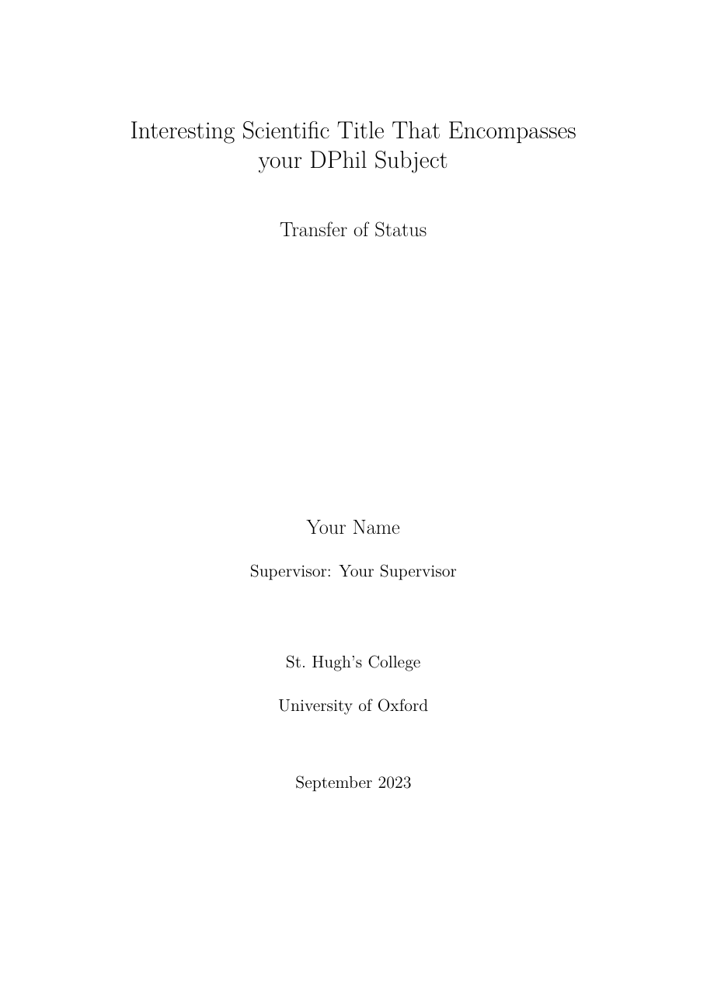

# Oxford Transfer of Status Quarto format

A Quarto PDF adaptation of the Oxford Transfer of Status LaTeX template by
[Joseph Rowell and Frank Fu](https://www.overleaf.com/latex/templates/oxford-transfer-of-status-template/nkbxmjcdhggb).

## Installing

Use the repository as a template to create an example document:

```bash
quarto use template kv9898/oxford-transfer
```

Or add only the extension to an existing project:

```bash
quarto add kv9898/oxford-transfer
```

## Using

```yaml
---
title: "The title of the DPhil project"
author: "Candidate Name"
supervisor: "Professor First Supervisor"
college: "College Name"
department: "Department of Politics and International Relations"
status: "Transfer of Status"
date: "July 2026"
abstract: |
  A short abstract for the report.
keywords: [central banking, quantitative easing, fiscal indemnities]
format:
  oxford-transfer-pdf:
    number-sections: true
---
```

The format supports `header-left`, `header-right`, `footer-left`, and
`supervisor-label`. Set `running-header: false` to suppress running headers and
`minimal-footer: true` to show only a centred page number without a rule. Lists
of figures and tables are controlled by `lof` and `lot`; set `lol: true` together
with `listings: true` to include a list of listings.

## Optional crest

The University of Oxford Belted Crest is a protected mark and is not distributed
by this repository. If you are authorized to use it, place your local copy at
`_extensions/oxford-transfer/figures/beltcrest.pdf` and add:

```yaml
crest: _extensions/oxford-transfer/figures/beltcrest.pdf
```

The example reserves the title-page space and renders successfully when that
file is absent. PDF files are ignored so the local crest cannot be accidentally
committed.

## Example

[`example.qmd`](example.qmd) recreates the structure and content of the original
template PDF using Quarto. The preview below is rendered without distributing
the Oxford crest.



## Attribution and licence

The original template is by Joseph Rowell and Frank Fu and is licensed under
[Creative Commons Attribution 4.0 International](https://creativecommons.org/licenses/by/4.0/).
This repository is a modified Quarto adaptation by Dianyi Yang and is released
under the same licence. See [ATTRIBUTION.md](ATTRIBUTION.md) and
[LICENSE](LICENSE). No endorsement by the original authors or the University of
Oxford is implied.
